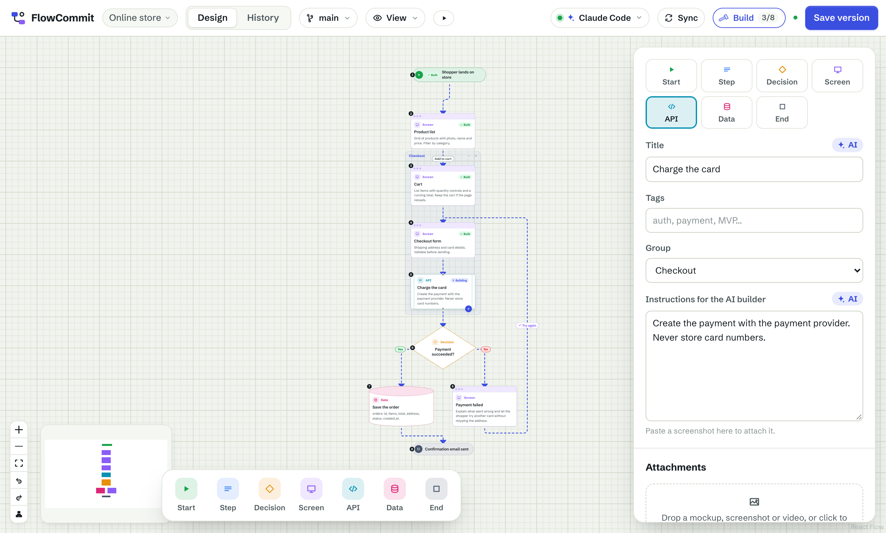
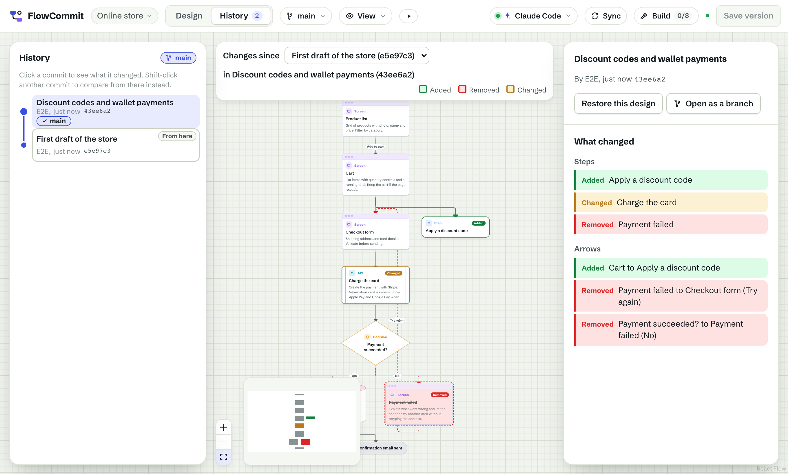
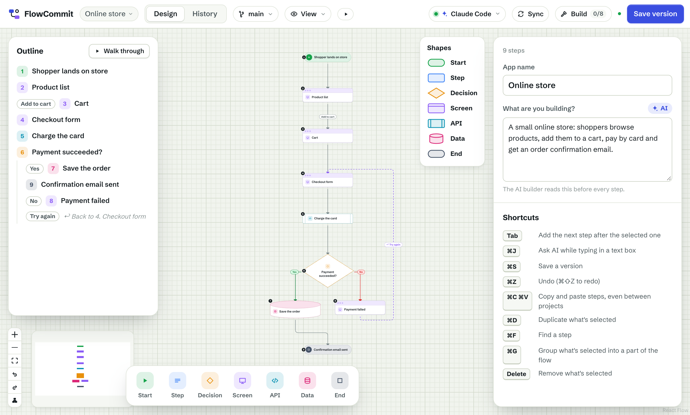

# FlowCommit

**Draw it. Commit it. AI builds it.**

FlowCommit is visual version control and an IDE for vibe coders. You design your app as a
flowchart, with instructions, screenshots and videos on each step. Claude Code or Codex
builds the code from it, one step at a time. Every change to the design is a version in Git
that you can compare, review and go back to.

[](https://www.npmjs.com/package/flowcommit)
[](https://github.com/bashar94/flowcommit/actions/workflows/ci.yml)
[](LICENSE)

<picture>
  <source media="(prefers-color-scheme: dark)" srcset="docs/images/editor-dark.png">
  
</picture>

## Why

When you build with AI, the plan lives in a chat that scrolls away, and the code is the only
record of what the app is meant to do. FlowCommit keeps the plan as a flowchart anyone can
read, makes it the spec your AI agent builds from, and keeps both in step:

- **The flowchart is the spec.** Seven step types, each with its own shape (a diamond for
  decisions, a browser window for screens, a cylinder for data), with instructions, images,
  videos and links. Mark up a screenshot to point at exactly what you mean.
- **AI builds from it.** Claude Code or Codex reads the flow through FlowCommit's MCP server
  and builds it step by step. Each card shows Building, Built or Changed since built.
- **Sync both ways.** Change a step and your AI tool is told what changed. Change the code
  and FlowCommit suggests how the flowchart should change, for you to accept or dismiss.
- **Every version in Git.** Save versions, see what changed on the canvas, review branches
  and pull requests as diagrams, and go back to any version's design and code.
- **No new accounts or keys.** It runs on your computer and uses the Claude Code or Codex
  sign-in you already have.

<picture>
  <source media="(prefers-color-scheme: dark)" srcset="docs/images/history-dark.png">
  
</picture>

## Quick start

You need [Node.js](https://nodejs.org) 20.19 or newer and Git. To build with AI, install
[Claude Code](https://claude.com/claude-code) or [Codex CLI](https://github.com/openai/codex)
and sign in once. Then, in your app's folder (or an empty one for a new app):

```sh
npx flowcommit
```

It opens FlowCommit for that folder in your browser. To have a `flowcommit` command
everywhere instead, run `npm install -g flowcommit`.

Then:

1. **Start a flow:** describe your app and let AI draw it, start from a template, or, if the
   folder already has code, let AI draw the flow from your code.
2. **Click Build** and follow the steps to connect Claude Code or Codex. Ask it to "build my
   app from the FlowCommit flow".
3. **Change the design** whenever you like, and save versions as you go.

FlowCommit opens on the first free port from 4318 (`--port` picks one, `--no-open` skips the
browser). Inside the app, click the project name at the top left to open another folder, pick
a recent project, or start a new one.

<picture>
  <source media="(prefers-color-scheme: dark)" srcset="docs/images/simple-dark.png">
  
</picture>

## Where your design is stored

Everything lives inside your project, next to your code:

```
your-app/
  .flowcommit/
    flow.json      the flowchart: steps, arrows, groups, instructions
    assets/        images and videos attached to steps
```

`flow.json` is plain, sorted JSON so Git diffs stay small and readable. The format is
documented in [docs/flow-format.md](docs/flow-format.md), with a JSON Schema in
[schema/](schema/flow-v1.schema.json). The only thing kept outside your project is the
list of recent projects, in `~/.flowcommit/recent.json`.

## AI help, using the AI tools you already have

FlowCommit doesn't need its own API key. If **Claude Code** (`claude`) or **Codex CLI**
(`codex`) is installed and signed in on your computer, FlowCommit finds it and uses it.
Pick which one in the menu at the top right.

- **Draw my flow:** on a new project, describe your app and the AI draws the first flowchart.
- **AI button on every text box** (or ⌘J while typing): make instructions clear enough for
  an AI builder, write them for you, shorten, fix grammar, or ask for any change. You see
  the suggestion first and choose whether to use it.

The AI tools run with all their own tools turned off, so they only write text. What you ask
about is sent to that tool's AI service with your account, the same as using it in a terminal.

## Build it with Claude Code or Codex

FlowCommit includes an MCP server, so an AI coding agent can build your app straight from
the flowchart, one step at a time. Click **Build** at the top of the app for the setup:

- **Claude Code:** click **Add to project** (this writes `.mcp.json` in your project), then
  run `claude` in your project folder and ask it to *build my app from the FlowCommit flow*,
  or type `/mcp__flowcommit__build`.
- **Codex CLI:** run the `codex mcp add flowcommit …` command shown in the dialog once, then
  start `codex` in your project folder with the same request.

While it works, each card shows **Building**, then **Built** with a summary and the files it
changed. If it's unsure about a step it asks instead of guessing, and the question appears
on the card (**Needs your answer**). Edit a step after it's built and the card shows
**Changed since built**; the agent then rebuilds just that step, with the exact changes.

You run the agent in your own terminal, so you approve its code changes as usual. Build
status is stored in `.flowcommit/status.json`, which stays out of your saved versions.

The tools the agent gets: `get_flow`, `next_step`, `get_step` (with mockup images),
`start_step`, `finish_step` and `report_problem`. The server lives in
`packages/server/src/mcp.ts`.

## Reading a flow

- **Arrows that explain themselves:** Yes branches are green and No branches red; an arrow
  that goes back up the flow (like "Try again") runs around the side as a dashed line marked ↩.
- **Highlighted paths:** hover over or select a step to light up everything that leads to it
  and follows from it. The rest fades back.
- **Step numbers** in reading order, so you can say "after step 4…".
- **Outline** (View → Outline): the whole flow as a numbered list, with each decision's
  branches indented and loops shown as "back to step N". Click a line to find that step.
- **Walk through** (top bar): a guided tour, one step at a time. At each decision you pick a
  branch (or press 1, 2…), and the camera follows. Use → and ← to move, Esc to stop.

## Two-way sync between FlowCommit and AI tools

The design and the code stay in step in both directions, and nothing is lost along the way.

**Design → code.** When you add, edit or delete steps, your AI tool learns about it:
- With Claude Code, the Build dialog can add a small hook (`.claude/settings.json`) that tells
  Claude what changed in the design at the start of every message, even if you don't mention it.
- For Codex, Cursor and other agents, it can add a FlowCommit section to `AGENTS.md`.
- The agent's `get_design_changes` tool lists edited steps (with the exact changes), new steps,
  and deleted steps whose code should be removed. Ask "Sync the code with the FlowCommit flow"
  or type `/mcp__flowcommit__sync`.

**Code → design.** AI tools never change your flowchart on their own; they suggest:
- While building, or when you ask for something directly in chat, the agent calls
  `suggest_flow_change` for anything the code does that the flowchart doesn't show.
- If code is edited outside a build (by hand, or by an agent without the FlowCommit tools),
  FlowCommit notices from the files' Git fingerprints and flags the step **Code changed**.
  **Sync → Suggest changes from edited code** has your AI tool read the changes (read-only)
  and turn them into suggestions.
- Review everything under **Sync** in the top bar: Accept or Dismiss each suggestion.
  Accepted suggestions become normal design edits, so they show up in your next version, and
  the step stays *Built*, since the code already does it.

Pending suggestions and build status live in `.flowcommit/` but are kept out of Git.

## Branches, history and GitHub

Everything is stored in your project's Git repository, so GitHub stays the home of your
design. FlowCommit runs the same `git` commands you would, with your own Git sign-in.

- **History as a graph:** every commit that changed the design, on every branch, newest
  first. Each branch is a colored lane, with tags showing where each branch (and its copy on
  GitHub) is now. Click a commit to see what it changed; shift-click another commit to
  compare from there. Commits made in a terminal, by teammates or by an AI agent show up on
  their own.
- **Branches** (the branch button in the top bar): switch branches, including ones that only
  exist on GitHub, or create a new one. Switching also switches your code, like `git switch`.
- **Review changes:** see everything a branch changed since it split off from your main
  branch, on the canvas, the way you'd review a pull request.
- **Sync with GitHub:** the branch button shows ↑ commits to push and ↓ commits to pull.
  Check GitHub, Pull and Push from its menu, and open a pull request on GitHub.
- **Pull requests:** sign in to the GitHub CLI (`gh auth login`) to list open pull requests
  and review each one's design changes in FlowCommit.
- **Secret check:** before a version is saved and before anything is pushed, FlowCommit looks
  for passwords and API keys (OpenAI, Anthropic, Stripe, AWS, GitHub and more), database
  addresses with passwords, and files like `.env` or private keys, in the code and in the
  steps' instructions. It shows where they are without showing them, and offers to leave the
  file out, keep it out of Git with `.gitignore`, or copy instructions for your AI builder to
  move them into environment variables. You can still save or push anyway. AI agents get the
  same warning when they finish a step. Add `flowcommit:allow-secret` to a line to skip it.

## Mark up images

Click **Mark up** on any attached image (or in the notice after you paste a screenshot) to
point at exactly what you mean:

- **Box** (B) around an area, **Arrow** (A) at something, **Pin** (P) on a spot, or **Draw** (D) freely
- Each mark gets a number and a note, like *"make this button our brand blue"*
- Four colors, undo (⌘Z), drag a mark to move it, Delete to remove it

When you save, FlowCommit also makes a copy of the image with the numbered marks drawn on
it. The AI builder receives that copy, the original, and the notes written out with where
each mark is ("Box around the middle left (x 21%–31%, y 47%–54%): make Add to cart blue"),
so a terminal agent knows exactly what you pointed at. Marks are saved in versions, and
changing them marks a built step as *changed since built*.

## Designing quickly

- Each step type has its own shape: pills for Start and End, a diamond for decisions, a
  browser window for screens, a box with side bars for APIs, and a cylinder for data.
  Decisions can send arrows from their left, right or bottom corner.
- Add **tags** to steps (like `auth` or `MVP`) to label them.
- **Group** steps into named parts of the app, like "Checkout": select them and press **⌘G**.
  A group is a frame you can drag by its title; fold it into one card to make a big flow
  readable, and click the card to open it again. Folding only changes your view.
- Use **View** at the top to choose what cards show. **Simple** shows only shapes and titles,
  which is the clearest way to explain the app to someone; turn on the **shape legend** too.

- Click the **+** under a step, or press **Tab**, to add the next connected step.
- Drag a step type from the toolbar at the bottom, or click it.
- Use **Tidy up** (next to the zoom buttons) to rearrange a messy flow top to bottom.
- Start from a template: sign-up and log-in, online store checkout, habit tracker, AI chat
  assistant, booking with a deposit, or team workspace.
- Already have code? A folder with code offers **Draw it from my code**: Claude Code or Codex
  reads the project (without changing it) and draws the flow it finds. Steps the code
  already does are marked built and linked to their files.
- **⌘Z / ⌘⇧Z** undo and redo on the canvas, **⌘C / ⌘V** copy and paste steps (even between
  projects), **⌘D** duplicates and **⌘F** finds a step.
- **View → Share a picture** downloads a PNG of the flow, or prints it so you can save a PDF.
- A built step lists its code files; click one to open it in VS Code, Cursor, Windsurf, Zed,
  a JetBrains IDE or your default app.

## Versions

Edits save automatically as a draft. Click **Save version** (or press ⌘S) to keep a
version in history. Leave the message blank and FlowCommit writes one from your changes.

Open **History** to see every version. Pick one to see what changed since the version
before it, colored on the canvas: green for added, red for removed, yellow for changed.
Click a step to see exactly which words, images and links changed. You can restore any
version, and it becomes your draft until you save again.

Versions are ordinary Git commits, so they sit alongside your code history. When the code
changed too, the save dialog offers **Include my code changes**: that version then holds the
design and the code that builds it. Otherwise a version only touches `.flowcommit/` and never
includes other files you have staged. If the folder isn't a Git repository yet, FlowCommit
offers to turn version history on.

In History, **Restore this design** brings back only the drawing. **Open as a branch** starts
a new branch at that version, so the design and the code both go back to it, and your current
branch stays as it was.

## Plugins

Plugins add templates to start from, ways to share a flow, and ways to build it. Add one with
`flowcommit plugin add <name or folder>`. [docs/plugins.md](docs/plugins.md) explains how to
write one, and [examples/plugins/local-templates](examples/plugins/local-templates) is a small
working example.

## Code layout

| Folder | What it is |
|---|---|
| `packages/shared` | The flow file format and the diff between two versions, shared by everything else |
| `packages/server` | Local server that reads and writes your project's `.flowcommit` folder |
| `packages/web` | The flowchart editor (React + React Flow) |
| `bin`, `scripts` | The `flowcommit` command and the build that bundles everything for it |
| `e2e` | Editor tests (Playwright) |
| `docs`, `schema` | The flow file format and plugin guide, and the flow JSON Schema |
| `examples/plugins` | Example plugins |

## Roadmap

See [ROADMAP.md](ROADMAP.md) for what's built and what's next.

## Working on FlowCommit itself

```sh
npm install
npm run dev
```

Then open http://localhost:5317. Run the tests with `npm test` (shared logic) and
`npm run test:e2e` (the editor, driven in your installed Chrome).

By default the dev server edits a `demo-project/` folder inside this repo. To design a real
project, point it at that project's folder:

```sh
FLOWCOMMIT_PROJECT=/path/to/your/app npm run dev
```

To work on two projects at once, give the second one its own ports:

```sh
FLOWCOMMIT_PROJECT=/path/to/other/app FLOWCOMMIT_PORT=4319 FLOWCOMMIT_WEB_PORT=5319 npm run dev
```

### Releasing

Set the new version in `package.json` and `FLOWCOMMIT_VERSION` (in
`packages/shared/src/flow.ts`), note the changes in [CHANGELOG.md](CHANGELOG.md), and push.
Then create a release on GitHub with a matching tag, like `v0.1.0`. The
[release workflow](.github/workflows/release.yml) runs every test and publishes to npm.

## Contributing

Bug reports, ideas and pull requests are welcome. [CONTRIBUTING.md](CONTRIBUTING.md) explains
how to set up, test and send a change. Please report security problems privately, as
[SECURITY.md](SECURITY.md) describes.

## License

FlowCommit is open source under the [Apache License 2.0](LICENSE). The license covers the
code, not the FlowCommit name or logo.
